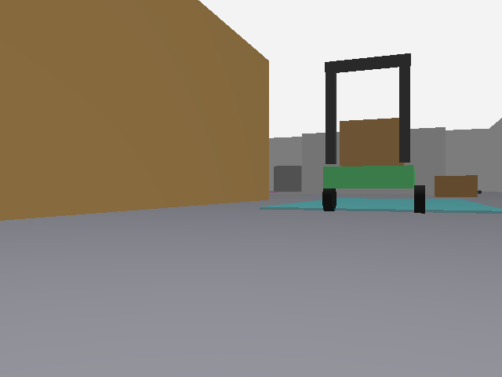

# Five-AMR ROS 2 warehouse simulation

This project simulates five autonomous mobile robots (AMRs) in a Gazebo Sim
warehouse. Robots `r1`–`r5` have independent ROS 2 namespaces, share their
state over DDS, exchange text messages, and run decentralized controllers.

The controller is **GNN-ready**: it receives peer state as a graph, but its
current `graph_policy()` is a deterministic goal-seeking / collision-avoidance
baseline, not a trained GNN model.



## Use the active workspace

Use [`multi_amr_ws`](multi_amr_ws) for the five-robot simulation. The
root-level `src/multi_amr_coordination` and `docker/run_multi_amr.sh` are a
legacy three-robot overlay retained only as reference.

## Prerequisites

The Gazebo computer needs Ubuntu/Linux with an X11 desktop session, Docker
Engine, Git, OpenGL-capable graphics, and Docker permission for the current
user. The project Dockerfile extends this pre-existing base image:

```bash
docker --version
docker image inspect ros2-humble-gazebo:latest
```

The second command must succeed before building. The base image contains ROS 2
Humble and Gazebo; this project adds Gazebo Sim ROS integration.

## Installation and first run

### 1. Clone

```bash
git clone https://github.com/KspTechforge06/AMR-ROS2-with-jetson-and-Rasp.git
cd AMR-ROS2-with-jetson-and-Rasp
```

### 2. Build the image

Build once (or after modifying `docker/Dockerfile`):

```bash
docker build -t ros2-humble-gazebo-multi-amr:latest -f docker/Dockerfile .
```

### 3. Start the five-AMR simulation

```bash
cd multi_amr_ws
./run_five_amr.sh
```

The script opens a Docker container named `five_amr_sim`, builds the required
ROS packages, then launches Gazebo, warehouse traffic, five robots, bridges,
and five sets of coordination nodes. Keep this terminal open; use `Ctrl+C` to
stop it.

### 4. Open a second ROS terminal

On the host, open another terminal and enter the running container:

```bash
docker exec -it five_amr_sim bash
source /opt/ros/humble/setup.bash
source /workspaces/multi_amr/install/setup.bash
export ROS_DOMAIN_ID=42
export FASTRTPS_DEFAULT_PROFILES_FILE=/workspaces/multi_amr/config/fastdds_udp.xml
ros2 node list
```

You should see `/r1/robot_state_node`, `/r2/decentralized_controller`,
`/r3/peer_message_node`, and equivalent nodes for all five robots.

## Robot communication

Each robot has these three nodes:

| Node | Subscribes to | Publishes | Responsibility |
| --- | --- | --- | --- |
| `robot_state_node` | `/<robot>/odom`, `/<robot>/scan` | `/<robot>/state` | Produces the compact local state vector. |
| `decentralized_controller` | `/r1/state` through `/r5/state` | `/<robot>/gnn_action`, `/<robot>/cmd_vel` | Computes a local velocity action from all peer states. |
| `peer_message_node` | `/r1/message` through `/r5/message` | — | Logs text messages received from other robots. |

The shared state vector is:

```text
[x, y, yaw, linear_x, angular_z, goal_x, goal_y, nearest_obstacle_m]
```

### Send an R1 message

In the second container terminal:

```bash
ros2 topic pub --once /r1/message std_msgs/msg/String \
  "{data: 'R1: pallet aisle is clear'}"
```

R2–R5 log the message in their `peer_message_node` output. R1 does not log its
own message.

### Watch R3 receive messages from R1 and R2

In one terminal, run two echoes:

```bash
ros2 topic echo /r1/message &
ros2 topic echo /r2/message &
wait
```

Publish to `/r1/message` and `/r2/message` from other terminals. Stop both
echoes with `Ctrl+C`.

### Inspect state and actions

```bash
ros2 topic echo /r3/state
ros2 topic echo /r3/gnn_action
ros2 topic hz /r1/state
```

## RQT graph

From the second terminal (after sourcing ROS and setting the DDS profile):

```bash
rqt_graph
```

In the RQT Graph window, uncheck **Hide single connection topics**, **Hide
dead sinks**, and **Hide leaf topics** if they are enabled. Search for
`r1|r2|r3|r4|r5`. You should see every `/<robot>/state` topic feeding all
decentralized controllers and each peer message node subscribed to the five
message topics.

If only one robot is visible, verify:

```bash
echo "$FASTRTPS_DEFAULT_PROFILES_FILE"
```

It must print `/workspaces/multi_amr/config/fastdds_udp.xml` in the terminal
that starts RQT.

## Jetson and Raspberry Pi deployment

Gazebo normally runs every agent locally. To make the Jetson/Pis act as robot
nodes, keep Gazebo and the ROS/Gazebo bridges on the laptop, then start one
agent identity per board.

### 1. Configure every device

All devices must be on the same LAN, allow DDS UDP/multicast traffic, and use
the same domain ID:

```bash
export ROS_DOMAIN_ID=42
```

Copy `multi_amr_ws/config/fastdds_udp.xml` to the Jetson and each Pi, then:

```bash
export FASTRTPS_DEFAULT_PROFILES_FILE=/path/to/fastdds_udp.xml
```

Each board needs ROS 2 Humble and a built copy of the
`multi_amr_coordination` package. Gazebo is not required on a board that only
runs a coordination agent.

### 2. Start the simulation without local agents

Inside the container, start the five simulated robots and bridges but omit the
local controllers:

```bash
source /workspaces/multi_amr/install/setup.bash
ros2 launch multi_amr_coordination warehouse_five_robots.launch.py launch_agents:=false
```

### 3. Start one agent per computer

On each board, source ROS 2 and its built workspace, then use a unique robot
name. For example:

```bash
# Jetson
ros2 launch multi_amr_coordination robot_agent.launch.py \
  robot_name:=r1 goal_x:=5.5 goal_y:=4.5

# Raspberry Pi 1
ros2 launch multi_amr_coordination robot_agent.launch.py \
  robot_name:=r2 goal_x:=5.8 goal_y:=-4.5

# Raspberry Pi 2
ros2 launch multi_amr_coordination robot_agent.launch.py \
  robot_name:=r3 goal_x:=-6.5 goal_y:=3.8
```

R4 and R5 may run on the laptop or two additional computers using the same
launch command with their own robot names.

## Files and folders

```text
.
├── docker/                         Docker image configuration
├── src/multi_amr_coordination/     Legacy three-robot overlay; reference only
└── multi_amr_ws/                   Active five-AMR workspace
    ├── config/                     Fast DDS transport configuration
    ├── docs/images/                Saved simulation images
    ├── tools/                      Operational utilities
    └── src/                        ROS 2 packages and Gazebo assets
```

| File or folder | Purpose |
| --- | --- |
| `docker/Dockerfile` | Creates `ros2-humble-gazebo-multi-amr` with `ros_gz_sim`, `ros_gz_bridge`, Colcon and robot-state-publisher. |
| `docker/entrypoint.sh` | Sources ROS 2 and the built workspace automatically inside the image. |
| `multi_amr_ws/run_five_amr.sh` | Main Docker launcher. Uses host networking, X11 display access and the UDP Fast DDS profile. |
| `multi_amr_ws/config/fastdds_udp.xml` | Forces UDPv4 DDS instead of Fast DDS shared memory, allowing Docker, RQT, Jetson and Pi nodes to discover one another. |
| `multi_amr_ws/docs/images/warehouse_r1_camera.png` | A saved R1 simulated-camera image from the warehouse run. |
| `multi_amr_ws/tools/capture_ros_image.py` | Subscribes to a ROS image topic and saves one PNG frame. |
| `src/multi_amr_coordination/launch/warehouse_three_robots.launch.py` | Historical filename, but this is the actual five-robot launcher: Gazebo, traffic, R1–R5, bridges and optional agents. |
| `src/multi_amr_coordination/launch/warehouse_five_robots.launch.py` | Compatibility launcher that includes the preceding file. |
| `src/multi_amr_coordination/launch/robot_agent.launch.py` | Starts `robot_state_node`, `decentralized_controller` and `peer_message_node` for one robot. Use this on a Jetson/Pi. |
| `robot_state_node.py` | Builds and publishes the eight-value `/<robot>/state` vector using odometry and LiDAR. |
| `decentralized_controller.py` | Reads all state topics, runs the graph-ready policy and publishes a velocity command and `gnn_action`. Replace `graph_policy()` with trained inference later. |
| `peer_message_node.py` | Receives and logs text messages published by the other robot namespaces. |
| `src/multi_modal_worlds/worlds/warehouse.sdf` | Main Gazebo warehouse world. |
| `src/multi_modal_worlds/src/warehouse_traffic_controller.py` | Moves dynamic warehouse traffic/obstacles. |
| `src/multi_modal_robot_description/urdf/robot_description.urdf` | Robot body, sensors and Gazebo plugins. |
| `src/multi_modal_bringup/` | Navigation, SLAM, EKF, maps and RViz configurations for later integration. |
| `src/multi_modal_perception/` | YOLO, camera/LiDAR association and obstacle-classification packages. |

## Troubleshooting

### `five_amr_sim` already exists

```bash
docker rm -f five_amr_sim
```

Then run `./run_five_amr.sh` again.

### Gazebo does not open

Run from a local X11 desktop session and confirm `echo $DISPLAY` is set. The
launch script temporarily grants the Docker container display access.

### External devices do not discover topics

Confirm that all devices use `ROS_DOMAIN_ID=42`, the UDP DDS profile, the same
LAN, and no firewall or guest-Wi-Fi client isolation blocks multicast/UDP.

## Current limitations

- The controller is graph-ready but not a trained neural-network policy.
- `warehouse_three_robots.launch.py` has a historical name even though it
  starts five robots.
- Board deployment requires a matching ROS 2 Humble build of
  `multi_amr_coordination` on each board.
